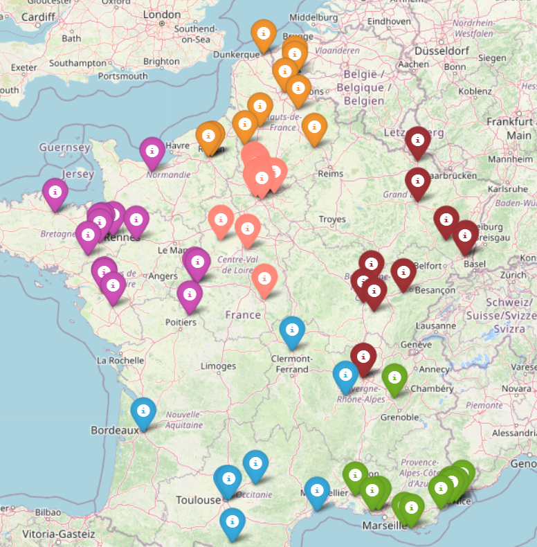

# Evolutionary Pool Optimizer

This project contains a Python class called EvoPoolOptimizer that uses an evolutionary algorithm to optimize cities in sport pools by distance, using NumPy only. The class can be easily initialized with a list of cities, the number of pools wanted and the number of chromosomes per population for the genetic algorithm.

In addition, a Jupyter notebook is provided and demonstrates a real use case of the EvoPoolOptimizer class.


<br/>

## Usage

Initialize a list of cities : 

```python
cities = ['Saint avertin', 'Tarascon', 'Nantes', 'Puygouzon', 'Toulouse', 'Talence', 'Balma', 'Reze', 'Chatellerault', 'Tours', 
          'Montaigu Bouffere', 'Bourges' ...]
```


```python
opt = EvoPoolOptimizer(cities_list=cities, nb_pools=6, nb_chromosomes=100)
```

<br/>

The coordinates of each city will automatically be downloaded and you will only have to start the optimization loop by following the code in the jupyter notebook. Then, you can observe the best result found with : 

```python
opt.display_map_pools_configuration(best_chromosome)

```
<br/>




