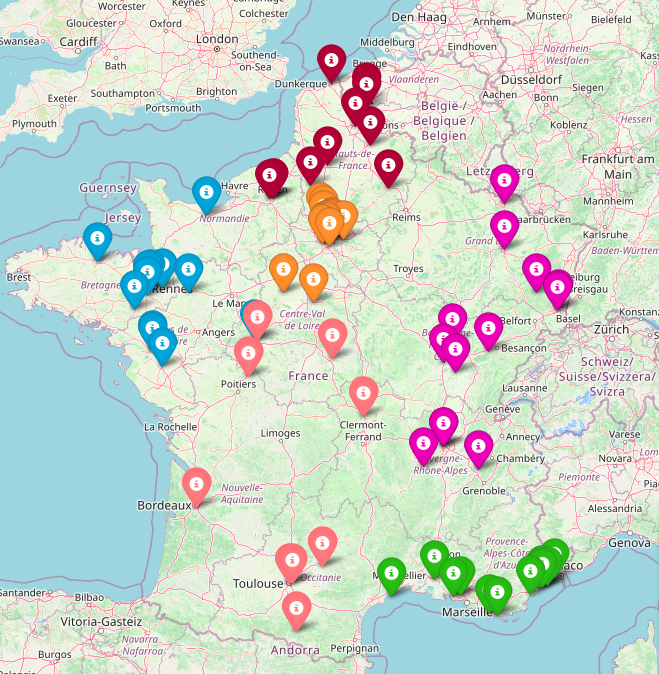

# Evolutionary Pool Optimizer

This project contains a Python class, called [EvoPoolOpt](EvoPoolOptimizer.py), that uses an evolutionary algorithm to optimize the distribution of cities inside sport pools, using NumPy only. An instance of the class can be easily initialized with a list of city names (their GPS coordinates will automatically be downloaded), the number of pools desired and the number of chromosomes per population for the genetic algorithm.

In addition, a [Jupyter notebook](volleyball_pools_optimization.ipynb) is provided to demonstrate a real use case, on the cities of the 2022/2023 french National 3 volley-ball division.

<br/>

## Usage

Create a list of cities : 

```python
cities = ['Saint avertin', 'Tarascon', 'Nantes', 'Puygouzon', 'Toulouse', 'Talence', 'Balma', 'Reze', 'Chatellerault', 'Tours', 
          'Montaigu Bouffere', 'Bourges', ...]
```

Initialize an instance of the EvoPoolOptimizer with the desired cities, the number of pools and the number of chromosomes of the genetic algorithm.

```python
opt = EvoPoolOpt(cities_list=cities, nb_pools=6, nb_chromosomes=100)
```

<br/>

The coordinates of each city will automatically be downloaded. You will only have to start start the optimization loop with the genetic algorithm by specifiying a number of iterations: 


```python
opt.optimize(num_iterations=num_iterations)
```
Then you can observe the final result with this line :

<br/>

```python
opt.display_map_pools_configuration(opt.best_chromosome)
```
<br/>



<br/>
