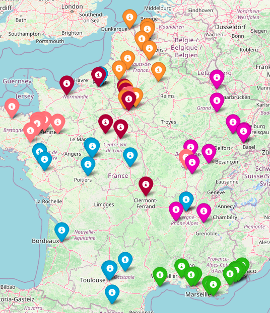

# Evolutionary Pool Optimizer

This project contains a Python class called EvoPoolOptimizer that uses an evolutionary algorithm to optimize cities in sport pools by distance, using NumPy only. The class can be easily initialized with a list of cities, the number of pools wanted and the number of chromosomes per population for the genetic algorithm.

In addition, a Jupyter notebook is provided and demonstrates a real use case of the EvoPoolOptimizer class.


<br/>

## Usage

Initialize a list of cities : 

```python
cities = ['Saint avertin', 'Tarascon', 'Nantes', 'Puygouzon', 'Toulouse', 'Talence', 'Balma', 'Reze', 'Chatellerault', 'Tours', 
          'Montaigu Bouffere', 'Bourges' ...]
```


```python
opt = EvoPoolOptimizer(cities_list=cities, nb_pools=6, nb_chromosomes=100)
```

<br/>

The coordinates of each city will automatically be downloaded and you will only have to start start the optimization loop as following : 


```python
opt.optimize(num_iterations=num_iterations, measurement_step=measurement_step)
```
Then you can observe the final result with this line :

<br/>


```python
opt.display_map_pools_configuration(opt.best_chromosome)
```
<br/>



<br/>

## Note

You even if the maps aren't displayed on the github file, you can find the example I used for the project in the 'volleyball_pools_optimization.ipynb' notebook.

